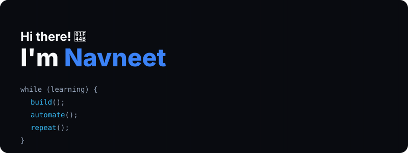

<table width="100%" align="center">
<tr>

<!-- ============================================== -->
<!-- LEFT SIDEBAR -->
<!-- ============================================== -->
<td width="22%" valign="top">
  

  
  <h2>Navneet ⚡</h2>
  
@Navneet23b-Git

  👨‍💻 Full Stack Developer 
  🤖 AI Enthusiast 
  🚀 DevOps Explorer

  I build scalable web apps, automate workflows and love turning complex problems into simple solutions.

  📍 Guwahati, India 
  ✉️ navneet.iitg06@gmail.com 
  🔗 <a href="https://linkedin.com/in/navneet-iitg">linkedin.com/in/navneet-iitg</a> 
  🌐 <a href="https://navneet.dev">navneet.dev</a>

<h3>Connect with me</h3>

  
  
  
  

<h3>Tech Stack</h3>

  

<h3>Highlights</h3>
<ul>
  <li>🏆 GitHub Campus Expert</li>
  <li>🎯 500+ LeetCode Problems</li>
  <li>🌟 Open Source Enthusiast</li>
</ul>

</td>

<!-- ============================================== -->
<!-- RIGHT CONTENT -->
<!-- ============================================== -->
<td width="78%" valign="top">

  

<h3>📁 Featured Projects</h3>

  

<h3>🌊 Contribution Ocean</h3>

  

  
<i>"Code is like humor. When you have to explain it, it's bad." — Cory House</i>

</td>
</tr>
</table>
