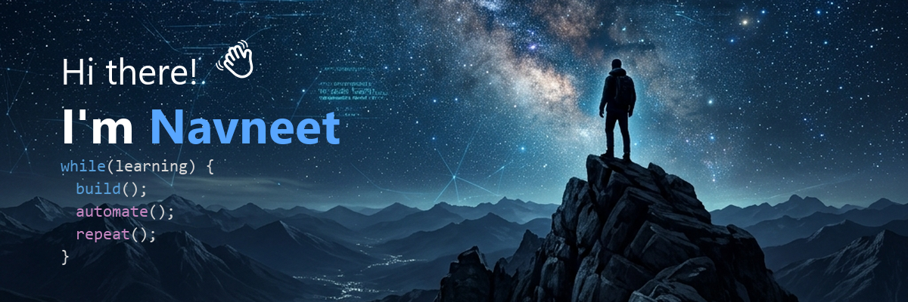

<!-- Header Image -->

  

 

<!-- About Me Section -->
<h3>👨‍💻 About Me</h3>

Passionate Full Stack Developer and AI Enthusiast. I love building scalable applications, automating workflows, and exploring the power of AI to solve real-world problems.

  <kbd>&nbsp;&nbsp;&nbsp;🎓 B.Tech CSE @ IIT Guwahati&nbsp;&nbsp;&nbsp;</kbd>&nbsp;&nbsp;&nbsp;&nbsp;&nbsp;&nbsp;
  <kbd>&nbsp;&nbsp;&nbsp;💼 SWE Intern @ AlgoUniversity&nbsp;&nbsp;&nbsp;</kbd>&nbsp;&nbsp;&nbsp;&nbsp;&nbsp;&nbsp;
  <kbd>&nbsp;&nbsp;&nbsp;🌱 Lifelong Learner&nbsp;&nbsp;&nbsp;</kbd>&nbsp;&nbsp;&nbsp;&nbsp;&nbsp;&nbsp;
  <kbd>&nbsp;&nbsp;&nbsp;🚀 Open Source Enthusiast&nbsp;&nbsp;&nbsp;</kbd>

 

<!-- Featured Projects -->
### 🚀 Featured Projects
<table width="100%">
  <tr>
    <td width="50%">
      <a href="#">
        <!-- Note: Replace "repo-name" with your actual repo names to load the real data -->
        
      </a>
    </td>
    <td width="50%">
      
    </td>
  </tr>
  <tr>
    <td width="50%">
      
    </td>
    <td width="50%">
      
    </td>
  </tr>
</table>

  <a href="#">View all repositories ➔</a>

 

<!-- Tech Stack -->
### 🛠️ Tech Stack

  
<b>Frontend</b> &nbsp;&nbsp;&nbsp;&nbsp;&nbsp;&nbsp;&nbsp;&nbsp;&nbsp;&nbsp;&nbsp;&nbsp;&nbsp;&nbsp; <b>Backend</b> &nbsp;&nbsp;&nbsp;&nbsp;&nbsp;&nbsp;&nbsp;&nbsp;&nbsp;&nbsp;&nbsp;&nbsp;&nbsp;&nbsp; <b>AI / ML</b> &nbsp;&nbsp;&nbsp;&nbsp;&nbsp;&nbsp;&nbsp;&nbsp;&nbsp;&nbsp;&nbsp;&nbsp;&nbsp;&nbsp; <b>Database</b> &nbsp;&nbsp;&nbsp;&nbsp;&nbsp;&nbsp;&nbsp;&nbsp;&nbsp;&nbsp;&nbsp;&nbsp;&nbsp;&nbsp; <b>DevOps / Cloud</b>

   &nbsp;
   &nbsp;
   &nbsp;
   &nbsp;
  

 

<!-- Connect With Me -->
### 🔗 Connect With Me

  
  
  
  
  
  

 

<!-- Connect With Ocean (Contribution Graph) -->
### 🌊 Connect With Ocean

  <!-- Placeholder for Ocean custom graph -->
  

 

<!-- GitHub Analytics -->
### 📊 GitHub Analytics
<table width="100%">
  <tr>
    <td width="33%" align="center">
      
    </td>
    <td width="33%" align="center">
      
    </td>
    <td width="33%" align="center">
      
    </td>
  </tr>
</table>

 

<!-- Recent Activity & Highlights -->
<table width="100%">
  <tr>
    <td width="50%" valign="top">
      <h3>📝 Recent Contribution Activity</h3>
      <ul>
        <li>➕ Pushed to <a href="#">ai-email-assistant</a> (2 hours ago)</li>
        <li>🚨 Opened issue in <a href="#">self-healing-cicd</a> (1 day ago)</li>
        <li>🔀 Merged PR in <a href="#">ai-pr-reviewer</a> (2 days ago)</li>
        <li>✅ Closed issue in <a href="#">smart-library-system</a> (5 days ago)</li>
        <li>➕ Pushed to <a href="#">portfolio-website</a> (5 days ago)</li>
        <li>📁 Created a new repository <a href="#">system-design-notes</a> (1 week ago)</li>
        <li>🏅 Earned the <b>Pull Shark</b> badge (1 week ago)</li>
      </ul>
      
<a href="#">View all activity ➔</a>

    </td>
    <td width="50%" valign="top">
      <h3>🏆 Highlights</h3>
      <ul>
        <li>🎓 GitHub Campus Expert</li>
        <li>💪 500+ LeetCode Problems Solved</li>
        <li>🎯 HWi OA Round Qualified</li>
        <li>🥇 JGEC Volleyball Runner Up</li>
        <li>💼 SWE Intern @ AlgoUniversity</li>
        <li>🚀 Built multiple AI-powered projects</li>
      </ul>
    </td>
  </tr>
</table>

 

<!-- GitHub Badges -->
### 🏅 GitHub Badges

  
  
  
  
  
  
  
   
   
  <a href="#">View all badges ➔</a>

 

<!-- Three Columns: Experience, Learning, Timeline -->
<table width="100%">
  <tr>
    <td width="33%" valign="top">
      <h3>💼 Experience</h3>
      <b>Software Engineer Intern</b> 
      <i>AlgoUniversity</i> 
      May 2023 - Present 
      <ul>
        <li>Built and enhanced full stack applications.</li>
        <li>Developed scalable backend APIs.</li>
        <li>Collaborated with mentors on production-level projects.</li>
      </ul>
      <small><b>Tech:</b> React, Node.js, Express, MongoDB, Redis</small>
    </td>
    <td width="33%" valign="top">
      <h3>📚 Currently Learning</h3>
      <ul>
        <li>Apache Kafka</li>
        <li>Distributed Systems</li>
        <li>System Design</li>
        <li>AWS Advanced Services</li>
        <li>LLMs & RAG</li>
        <li>Microservices Architecture</li>
      </ul>
    </td>
    <td width="33%" valign="top">
      <h3>⏳ Timeline</h3>
      <ul>
        <li><b>2026:</b> SWE Intern @ AlgoUniversity</li>
        <li><b>2025:</b> Built AI Projects & Open Source</li>
        <li><b>2024:</b> Deepened in Full Stack Development</li>
        <li><b>2023:</b> Started B.Tech @ IIT Guwahati</li>
      </ul>
    </td>
  </tr>
</table>

 

<!-- Quote -->

   
  <i>"Code is like humor. When you have to explain it, it's bad." — Cory House</i>
    

